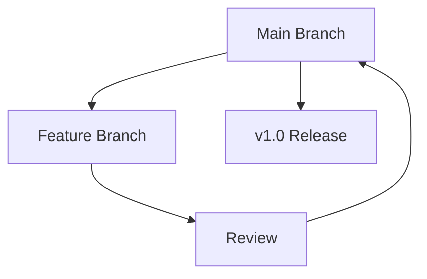

## Overview

Martin Acero organizes your project documentation into flexible spaces. You manage content, workflows, and teams efficiently. Grasp these concepts to build scalable docs.

<Columns cols={3}>
  <Card title="Spaces" icon="layers" href="#spaces">
    Hierarchical structures for organizing docs.
  </Card>
  <Card title="Workflows" icon="git-branch" href="#workflows">
    Version control and collaboration tools.
  </Card>
  <Card title="Customization" icon="palette" href="#customization">
    Templates and styling options.
  </Card>
</Columns>

## Documentation Spaces and Structure

Spaces act as containers for your documentation. You create nested hierarchies to group related pages, like `/api-reference` under a project space.

Use YAML frontmatter to define metadata:

````yaml
---
title: API Endpoint
description: Handles user requests.
space: projects/api
---
````

This structure ensures discoverability. Link spaces via navigation configs for seamless browsing.

<Callout kind="info">
  Spaces support unlimited nesting. Start with top-level projects, then add sub-spaces for features.
</Callout>

## Project Workflows and Versioning

You streamline workflows with branching and merges, similar to Git. Create branches for drafts, review changes, and merge to main.

<Steps>
  <Step title="Create Branch" icon="git-branch">
    Select your space and click "New Branch".

    ````bash
    martin branch create feature-login --space projects/auth
    ````
  </Step>
  <Step title="Make Changes" icon="edit">
    Edit pages in the branch.
  </Step>
  <Step title="Review & Merge" icon="git-merge">
    Compare diffs and approve.

    ````bash
    martin merge feature-login --into main
    ````
  </Step>
</Steps>

Versioning tags releases automatically, like `v1.2.0`.



## Customization and Templates

Tailor docs with reusable templates. Choose from built-ins or create custom ones.

<Tabs>
  <Tab title="Markdown Template" icon="file-text">
    Standard MDX for rich components.

    ````mdx
    ---
    title: Custom Page
    ---

    ## Hello

    Use `<Callout>` for notes.
    ````
  </Tab>
  <Tab title="YAML Config" icon="settings">
    Global space settings.

    ````yaml
    theme:
      color: "#3B82F6"
    navigation:
      - /introduction
      - /concepts
    ````
  </Tab>
</Tabs>

<CodeGroup tabs="JavaScript,Python">
  ```javascript
  const template = {
    title: 'Dynamic Page',
    content: 'Generated docs'
  };
  ```
  ```python
  template = {
      'title': 'Dynamic Page',
      'content': 'Generated docs'
  }
  ```
</CodeGroup>

## Scalability for Team Projects

For teams, enable permissions and webhooks. Assign roles like editor or viewer per space.

<ExpandableGroup>
  <Expandable title="Role Permissions" default-open="true">
    Define granular access:

    | Role     | Read | Write | Admin |
    |----------|------|-------|-------|
    | Viewer   | Yes  | No    | No    |
    | Editor   | Yes  | Yes   | No    |
    | Admin    | Yes  | Yes   | Yes   |
  </Expandable>
  <Expandable title="Webhook Integration">
    Notify external services on updates.

    ````javascript
    POST https://api.example.com/webhooks/martin-acero
    {
      "event": "page.updated",
      "space": "projects/docs"
    }
    ````
  </Expandable>
</ExpandableGroup>

<Callout kind="tip">
  Scale by sharding large projects into multiple spaces. Monitor usage via dashboard at `https://dashboard.example.com`.
</Callout>

Master these concepts to manage complex documentation effectively.