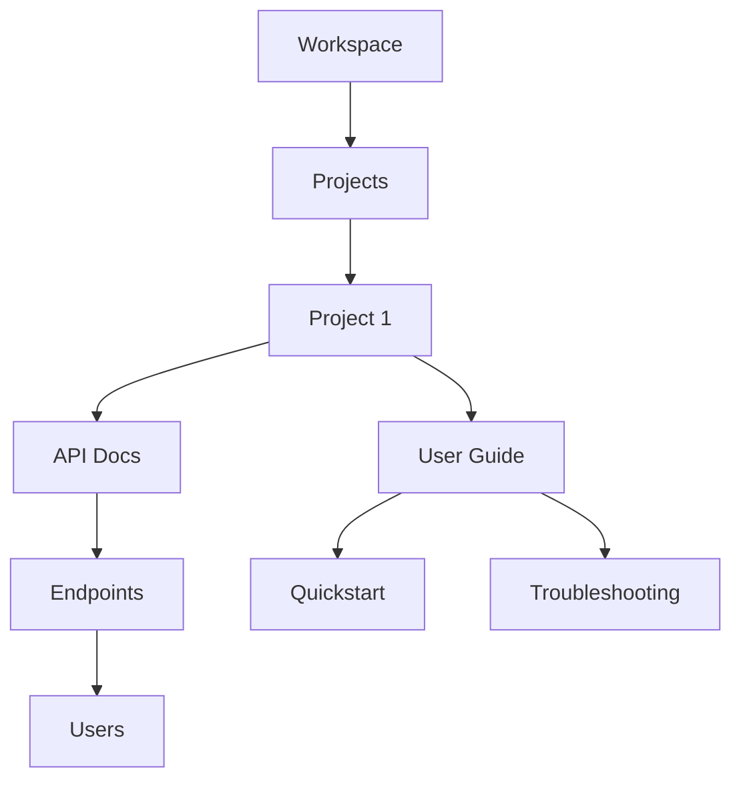

## Overview

Martin Acero provides powerful tools to manage your project documentation efficiently. You organize content into hierarchical structures, edit with rich formatting, collaborate seamlessly with teams, and navigate quickly using advanced search.

<Columns cols={2}>
  <Card title="Organize" icon="folder" href="#document-organization">
    Build nested document trees for clear structure.
  </Card>
  <Card title="Edit" icon="edit-3" href="#editing-options">
    Use markdown or visual editors with live previews.
  </Card>
  <Card title="Collaborate" icon="users" href="#collaboration">
    Share, review, and co-edit in real time.
  </Card>
  <Card title="Search" icon="search" href="#search-navigation">
    Find content instantly across your docs.
  </Card>
</Columns>

## Document Organization and Hierarchy

Create a clear document structure with folders and pages. You nest pages indefinitely to match your project's architecture, like API references under endpoints or guides under tutorials.



<Callout kind="tip">
  Start with a top-level workspace, then add projects for separation.
</Callout>

## Editing and Formatting Options

Martin Acero supports markdown editing with live previews and syntax highlighting. You format text, add code blocks, tables, and embeds effortlessly.

<Tabs>
  <Tab title="Markdown" icon="code">
    Write in standard markdown for precise control.

````markdown
# Heading

**Bold text** and _italics_.

```javascript
console.log("Hello, Martin Acero!");
```
````

  </Tab>
  <Tab title="Visual Editor" icon="edit">
    Drag-and-drop blocks for non-technical users.

    Use the toolbar to insert images, videos, or callouts without code.
  </Tab>
</Tabs>

<Steps>
  <Step title="Format Text" icon="type">
    Select text and apply bold, italic, or links via the menu.
  </Step>
  <Step title="Add Code" icon="code">
    Insert a code block and choose the language for highlighting.
  </Step>
  <Step title="Embed Media" icon="image">
    Paste URLs for automatic embeds from YouTube or GitHub.
  </Step>
</Steps>

## Collaboration and Sharing Features

Invite team members to co-edit documents in real time. You track changes, leave comments, and publish versions for review.

<Expandable title="Advanced Permissions" default-open="false">
  Set roles like Viewer, Editor, or Admin. Use public links for sharing without accounts.
</Expandable>

Here's a collaboration workflow:

<Steps>
  <Step title="Invite Users" icon="user-plus">
    Add emails or generate shareable links.
  </Step>
  <Step title="Review Changes" icon="eye">
    View history and resolve comments inline.
  </Step>
  <Step title="Publish" icon="globe">
    Deploy updates to a custom domain like `docs.yourproject.com`.
  </Step>
</Steps>

<Callout kind="info">
  Real-time cursors show who edits what, reducing conflicts.
</Callout>

## Search and Navigation Tools

Search across all documents with fuzzy matching and filters by project or tag. The sidebar provides breadcrumb navigation and quick jumps.

<CodeGroup tabs="Advanced Search">
````javascript
// Client-side search example
const searchDocs = (query) => {
  return docs.filter(doc => 
    doc.title.includes(query) || 
    doc.content.includes(query)
  );
};
````
````python
# Server-side indexing
import whoosh.index as index

ix = index.open_dir("indexdir")
searcher = ix.searcher()
query = QueryParser("content", ix.schema).parse("martin acero")
results = searcher.search(query)
````
</CodeGroup>

Use tags like `api`, `guide` for better organization. Keyboard shortcuts like `<kbd>Ctrl</kbd>+<kbd>K</kbd>` open global search instantly.

This setup ensures you stay productive while scaling your documentation.